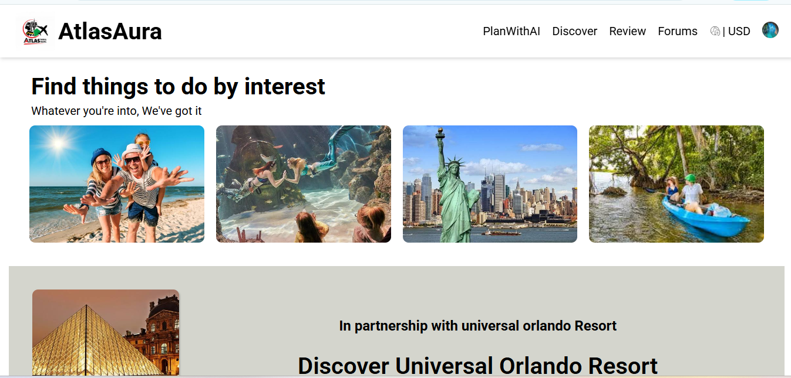
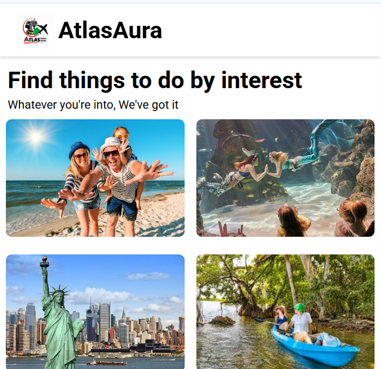

# 🌍 AtlasAura Trip Website

AtlasAura is a responsive travel website designed to help users explore destinations, activities, hotels, restaurants, cruises, and travel experiences.

## 🔗 Live Website

👉 https://inthusha20241647-commits.github.io/AtlasAura/

## 📸 Screenshots

### 🖥️ Desktop View

### 📱 Mobile View

## ✨ Features

* 🌍 Destination search interface
* 🤖 AI search option
* 🔎 Search functionality UI
* 🏨 Hotels, restaurants, and cruise categories
* 🚲 Travel experience sections
* 📍 Experiences near Colombo
* ⭐ Ratings and pricing cards
* 📱 Responsive design
* 🖼️ Travel image gallery
* 📌 Sticky navigation bar

## 🛠️ Technologies Used

* HTML5
* CSS3
* Flexbox
* CSS Grid
* Media Queries
* Google Fonts

## 🚀 How to Run

1. Clone the repository.
2. Open the project in VS Code.
3. Open `index.html` in your browser.

You can also use the **Live Server** extension in VS Code.

## 📱 Responsive Design

AtlasAura is designed for:

* 💻 Desktop
* 💻 Laptop
* 📱 Tablet
* 📱 Mobile

The layout adapts using CSS media queries.

## 🎯 Project Purpose

A front-end travel website project created to practice responsive web design, layouts, navigation, cards, search interfaces, and modern website styling.
